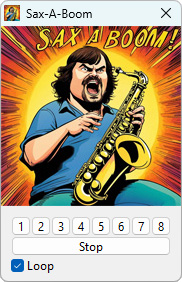

# Sax-A-Boom

This application allows you to play the famous Sax-A-Boom.

It's like a saxophone, but it's a Sax-A-Boom.

## Instructions
Press buttons or keys \
1-7: Licks \
8: Rhythm only

Play Sax-A-Boom like Jack Black: 7, 7, 7, 7, 3, 4, 4, 1, 8 \
https://www.youtube.com/watch?v=cLmCJKT5ssw&t=66s

## Download
Windows: [sax-a-boom.exe](https://github.com/alexgit2k/sax-a-boom/releases/latest/download/sax-a-boom.exe)

## Sources
Original idea, sounds, graphics: Sax-A-Boom from Kawasaki® by DSI Electronics™ \
Sound: https://www.youtube.com/watch?v=sVZYMeXIR5s \
Picture / Icon: Stable Diffusion (https://stability.ai/)

## License and Copyright
This software is copyright (c) 2023 by alexgit2k.

This is free software, licensed under MIT License.
